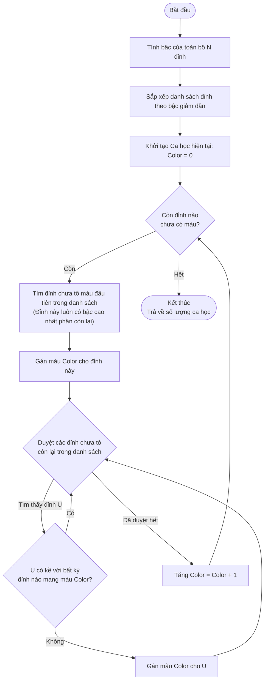

# 03 - Phân tích Thuật toán Welsh-Powell

## 1. Tổng quan về Welsh-Powell

Trong lớp các bài toán NP-Hard như Tô màu đồ thị (Graph Coloring), việc tìm ra số màu tối thiểu (Chromatic Number) là rất khó nếu giải bằng vét cạn. Vì vậy, các phương pháp **Tham lam (Greedy Heuristic)** thường được sử dụng để tiệm cận kết quả tối ưu trong thời gian khả thi.

Thuật toán **Welsh-Powell** ra đời năm 1967, là một bản nâng cấp đáng giá của thuật toán Greedy Coloring cơ bản. 

- **Greedy cơ bản:** Duyệt các đỉnh theo thứ tự ngẫu nhiên (hoặc thứ tự nhập vào).
- **Welsh-Powell:** Tiền xử lý (Pre-processing) bằng cách sắp xếp các đỉnh theo **Bậc (Degree)** giảm dần trước khi bắt đầu tô màu.

## 2. Nguyên lý Hoạt động (Tại sao lại xét Bậc giảm dần?)

Trong hệ thống xếp lịch học, **Bậc của một đỉnh** tương đương với số lượng xung đột của môn học đó (trùng giảng viên hoặc trùng sinh viên với các môn khác).

*Ví dụ:* Môn "Xác suất thống kê" là môn đại cương có rất nhiều sinh viên từ các lớp khác nhau học chung. Bậc của môn này trên đồ thị sẽ rất lớn. Nếu xử lý môn này muộn (giống như Greedy cơ bản), các ca học khả dụng có thể đã bị các môn nhỏ lẻ (bậc thấp) chiếm hết, dẫn đến việc phải mở thêm một ca học mới một cách lãng phí.

**Chiến lược của Welsh-Powell:** 
> "Giải quyết những kẻ rắc rối nhất đầu tiên." 

Bằng cách ưu tiên xử lý các đỉnh có Bậc cao nhất, thuật toán đảm bảo những môn học khó xếp lịch nhất sẽ được cấp phát ca học (màu) sớm nhất, giúp không gian nghiệm về sau rộng rãi hơn và giảm thiểu tổng số ca học cần sử dụng.

## 3. Mã giả (Pseudocode)

```text
HÀM WelshPowell(ĐồThị G):
    // 1. Tính bậc và sắp xếp
    DanhSachĐỉnh = Các đỉnh của G
    Tính Bậc(v) cho mọi đỉnh v trong DanhSachĐỉnh
    Sắp xếp DanhSachĐỉnh theo Bậc(v) giảm dần

    // 2. Khởi tạo
    MàuHiệnTại = 0
    SốĐỉnhChưaTô = Số lượng đỉnh của G
    MảngMàu = Gán tất cả đỉnh là CHƯA_TÔ

    // 3. Tiến hành tô màu
    TRONG KHI SốĐỉnhChưaTô > 0:
        // Tìm đỉnh hạt giống cho MàuHiệnTại
        CHO MỖI đỉnh V trong DanhSachĐỉnh:
            NẾU MảngMàu[V] == CHƯA_TÔ:
                MảngMàu[V] = MàuHiệnTại
                SốĐỉnhChưaTô = SốĐỉnhChưaTô - 1
                
                // Cố gắng tô cùng MàuHiệnTại cho các đỉnh khác
                CHO MỖI đỉnh U trong DanhSachĐỉnh nằm sau V:
                    NẾU MảngMàu[U] == CHƯA_TÔ VÀ U KHÔNG KỀ VỚI bất kỳ đỉnh nào có MàuHiệnTại:
                        MảngMàu[U] = MàuHiệnTại
                        SốĐỉnhChưaTô = SốĐỉnhChưaTô - 1
                
                // Chuyển sang màu mới khi không thể tô thêm MàuHiệnTại
                MàuHiệnTại = MàuHiệnTại + 1
                NGẮT VÒNG LẶP CHO MỖI (break để quay lại vòng lặp TRONG KHI)
    
    TRẢ VỀ MảngMàu, MàuHiệnTại (Số ca học đã dùng)
```

## 4. Lưu đồ Thuật toán



## 5. Triển khai Thực tế (C++ Implementation)

Trong file `src/algorithm/WelshPowell.cpp`, logic được map trực tiếp từ lớp `ConflictGraph` đã xây dựng ở Phase 2:

**Bước 1 & 2: Khởi tạo và Sắp xếp**
Sử dụng `std::iota` để tạo danh sách chỉ mục và `std::sort` kết hợp với lambda expression để sắp xếp dựa trên hàm `graph.getDegree()`.
```cpp
std::vector<int> vertices(n);
std::iota(vertices.begin(), vertices.end(), 0);

std::sort(vertices.begin(), vertices.end(), [&](int a, int b) {
    return graph.getDegree(a) > graph.getDegree(b);
});
```

**Bước 3: Lan truyền màu (Color Spreading)**
Sử dụng 3 vòng lặp lồng nhau:
1. **`while (uncoloredCount > 0)`**: Duyệt qua từng màu (Ca học).
2. **`for (int i = 0; i < n; ++i)`**: Tìm đỉnh "hạt giống" (đỉnh bậc cao nhất chưa tô) để bắt đầu một màu mới.
3. **`for (int j = i + 1; j < n; ++j)`**: Quét tiếp phần còn lại của danh sách, xem có môn nào "nhét" chung vào ca học này được không (Kiểm tra bằng ma trận kề `adj[u][k]`).

## 6. Đánh giá Độ phức tạp (Complexity)

| Chỉ số | Big-O | Giải thích chi tiết |
| :--- | :--- | :--- |
| **Sắp xếp đỉnh (Time)** | **$\mathcal{O}(V \log V)$** | Gọi hàm sort trên danh sách V đỉnh. |
| **Quét tô màu (Time)** | **$\mathcal{O}(V^2)$** | Trong trường hợp xấu nhất, mỗi màu phải quét lại danh sách đỉnh và kiểm tra tập kề trên Ma trận kề. Tổng chi phí bị giới hạn bởi $\mathcal{O}(V^2)$. |
| **Tổng thời gian** | **$\mathcal{O}(V^2)$** | Việc tô màu áp đảo bước sắp xếp. Hoàn toàn khả thi với N môn học trong quy mô đại học (N ~ 1000). |
| **Không gian (Space)**| **$\mathcal{O}(V)$** | Chỉ cần dùng mảng lưu trữ cấu hình màu (`colors`) và danh sách đỉnh đã sort. (Chưa tính không gian của đồ thị đã build sẵn). |

## 7. Ưu điểm & Hạn chế

### Ưu điểm
- Nhanh, dễ cài đặt và gỡ lỗi (debug).
- Kết quả thường tốt hơn thuật toán Greedy cơ bản, đặc biệt đối với đồ thị dày (dense graph - nhiều xung đột).
- Phù hợp với bài toán xếp thời khóa biểu thực tế nơi có sự chênh lệch lớn về độ va chạm giữa các môn học.

### Hạn chế
- **Local Optima (Tối ưu cục bộ):** Welsh-Powell không đảm bảo tìm được nghiệm tối ưu tuyệt đối (Chromatic Number tối thiểu). Kết quả đôi khi phụ thuộc vào thứ tự đỉnh ngẫu nhiên nếu có nhiều đỉnh trùng bậc.
- **Không tự động đánh giá ràng buộc Không gian (Phòng học):** Thuật toán chỉ giải quyết Ràng buộc Thời gian. Sau khi cấp phát xong Ca học, quá trình gán Phòng học ở Phase 4 có thể thất bại nếu không đủ phòng. Tuy nhiên, kiến trúc của project đã chủ động thiết kế bộ phân tách này để Module Scheduler phía sau gánh vác xử lý tài nguyên phòng.
